# YelloBot — System Architecture

> Engineering reference for the YelloBot platform: a multi-tenant, document-aware AI chat application. This document describes what is **actually implemented** in this repository — every diagram, table, and claim below is derived directly from the source under `backend/app` and `frontend/src`.

**Audience:** engineers onboarding to the codebase, reviewers evaluating the system, and the author's own future self.

**Scope:** backend services, frontend architecture, the RAG pipeline, data model, deployment topology, security, and the engineering trade-offs behind each decision.

---

## Table of Contents

1. [Complete System Architecture](#1-complete-system-architecture)
2. [High-Level Deployment Architecture](#2-high-level-deployment-architecture)
3. [Frontend Architecture](#3-frontend-architecture)
4. [Backend Architecture](#4-backend-architecture)
5. [Request Lifecycle](#5-request-lifecycle)
6. [Authentication Flow](#6-authentication-flow)
7. [Complete RAG Architecture](#7-complete-rag-architecture)
8. [Document Ingestion Pipeline](#8-document-ingestion-pipeline)
9. [Chat Message Flow](#9-chat-message-flow)
10. [Prompt Construction Pipeline](#10-prompt-construction-pipeline)
11. [Conversation Memory Flow](#11-conversation-memory-flow)
12. [Database Relationships](#12-database-relationships)
13. [Data Flow Diagram](#13-data-flow-diagram)
14. [Project Isolation](#14-project-isolation)
15. [Voice Pipeline](#15-voice-pipeline)
16. [External Service Integration](#16-external-service-integration)
17. [Security Architecture](#17-security-architecture)
18. [Error Handling Flow](#18-error-handling-flow)
19. [Component Interaction](#19-component-interaction)
20. [Complete User Journey](#20-complete-user-journey)
21. [Folder Structure](#21-folder-structure)
22. [Technology Decision Map](#22-technology-decision-map)
23. [Latency & Performance Flow](#23-latency--performance-flow)
24. [Design Principles](#24-design-principles)

---

## 1. Complete System Architecture

YelloBot is a modular monolith: a single FastAPI process fronts every domain (auth, projects, documents, chat), backed by three specialized stores — PostgreSQL for relational state, Qdrant for vector search, and the local filesystem for original uploaded files — plus an Arq/Redis worker for CPU-heavy ingestion. Four external AI providers (Groq, Hugging Face, Tavily) are accessed exclusively through abstract `Provider` interfaces, never called directly from route handlers.

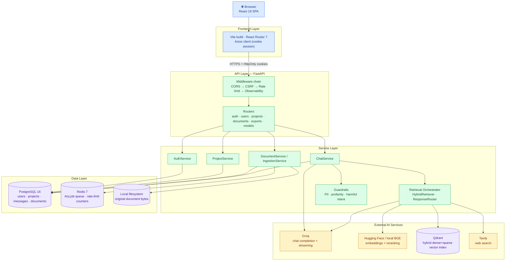

**What this diagram is telling you:** the API layer never talks to Postgres, Qdrant, or Groq directly — every access goes through a service. Services depend on abstract provider interfaces (`EmbeddingProvider`, `VectorStore`, `LLMProvider`, …), not concrete SDKs, so an external vendor can be swapped by changing one factory function (see [§22](#22-technology-decision-map)).

---

## 2. High-Level Deployment Architecture

Production splits the frontend (static, CDN-served) from the backend (stateful, containerized), with each external dependency reachable only from Render's private network or over authenticated HTTPS.

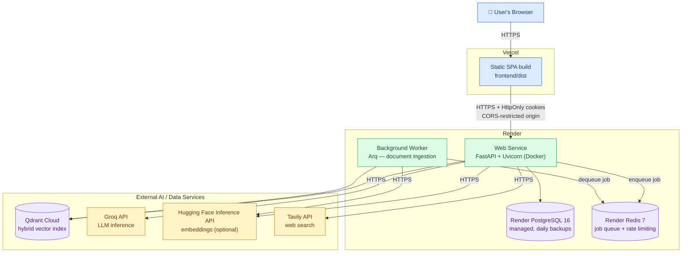

| Component | Where | Defined in |
|---|---|---|
| Frontend static build | Vercel | `frontend/vercel.json`, `VITE_API_URL` env |
| API + Worker | Render Blueprint | `deploy/render.yaml` |
| PostgreSQL | Render managed Postgres | `render.yaml` → `databases` |
| Redis | Render managed Redis | `render.yaml` → `services` (key-value) |
| Vector DB | Qdrant Cloud (or self-hosted) | `QDRANT_URL` / `QDRANT_API_KEY` |
| Local dev stack | Docker Compose | `docker-compose.yml` (Postgres + Redis + optional Qdrant profile) |

The API and worker are **separate Render services built from the same image** (`backend/Dockerfile`) with different start commands — the API runs `scripts/start_production.sh` (Uvicorn), the worker runs `arq app.workers.ingestion_worker.WorkerSettings`. This means an ingestion spike (large PDF, slow embedding model) cannot starve HTTP request handling; they scale and restart independently.

---

## 3. Frontend Architecture

The frontend is a single Vite-built React 19 SPA. `main.tsx` composes providers in a fixed order — theme is available before routing (to avoid a flash of unstyled content), auth wraps the router (`useNavigate`/`Navigate` inside `AuthContext` consumers need router context), and toast sits innermost since only authenticated views trigger toasts.

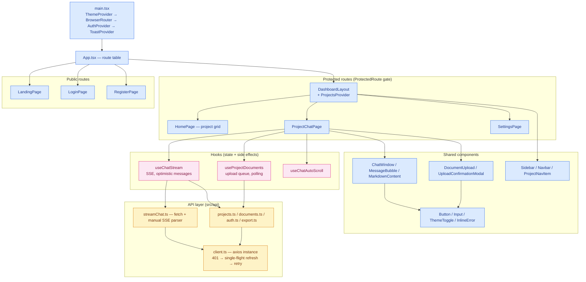

**Why hooks own the logic, not pages:** `ProjectChatPage` renders roughly 40 lines of JSX; all optimistic-update, SSE-buffering, and abort logic lives in `useChatStream`. This keeps the component testable without a DOM, and `useChatStream.test.ts` / `useProjectDocuments.test.ts` exercise the hooks directly with mocked API modules.

**State flow, concretely:**
- `AuthContext` is the only source of truth for "is there a logged-in user" — it calls `GET /users/me` once on mount (cookie-based, silent) and exposes `user`/`loading`. `ProtectedRoute` and `PublicRoute` are pure consumers of this state.
- `ProjectsContext` is scoped to `DashboardLayout` (not global) — it owns the project list, sorts pinned-then-recent, and is the only place `sidebarStorage` (last active project) is written.
- Chat state (`messages`, `streamingId`, `selectedModelId`) is local to `useChatStream`, re-created per `projectId` — switching projects doesn't leak state between chats.

---

## 4. Backend Architecture

Routers are thin: they extract path/body params, call exactly one service method, and translate `ValueError`/domain exceptions into HTTP status codes. All business logic lives in the service layer; all SQL lives in the repository layer.

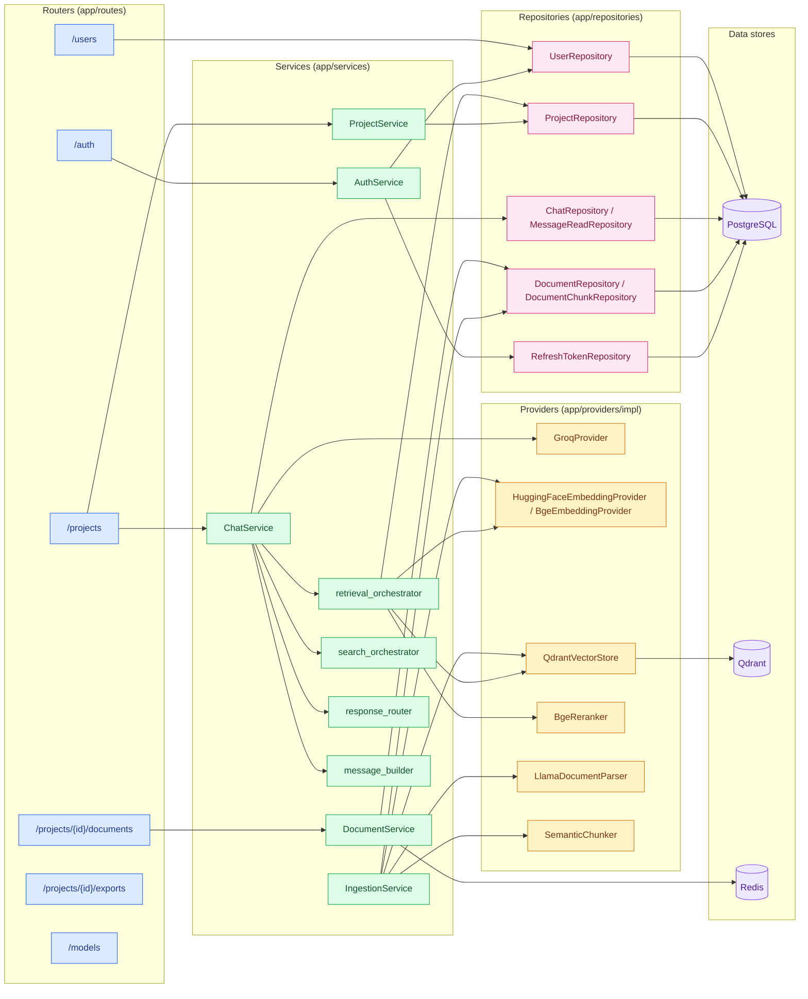

**There is no separate "repository interface" layer above SQLAlchemy** — repositories are static-method classes operating on a passed-in `Session`. This is a deliberate simplification: with one database and no plan to swap it, an interface would add indirection without benefit. Providers (embeddings, vector store, LLM, parser, chunker, reranker, query rewriter) *do* get abstract base classes (`app/providers/base.py`) because those genuinely have multiple real implementations already (Hugging Face vs. local BGE embeddings; Qdrant now, something else later) or benefit from test doubles.

---

## 5. Request Lifecycle

A synchronous (non-streaming) request end-to-end, using `POST /projects/{id}/chat` as the representative example. Middleware runs in registration order: CORS → CSRF → SlowAPI rate limiting → observability (request ID, Prometheus histogram).

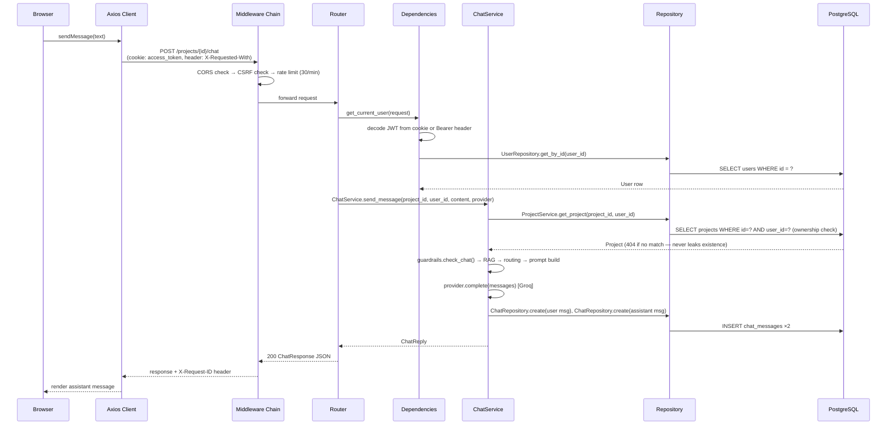

**Ownership is enforced once, at the top of every service method that needs a project** — `ProjectService.get_project(db, project_id, user_id)` filters by *both* columns in one query. A project that exists but belongs to another user returns the same 404 as a project that doesn't exist at all, so the API never reveals whether an ID is valid.

**Session lifetime matters for the streaming variant:** `ChatService.stream_message` deliberately does **not** hold a request-scoped `Session` across the LLM call — it opens a short-lived `SessionLocal()` inside `run_in_threadpool`, does one unit of work (load context, or persist one message), and closes it immediately. A Groq stream can run for 2–30 seconds; holding a pooled connection for that long would exhaust `db_pool_size` under concurrent load.

---

## 6. Authentication Flow

JWT access tokens (HS256, 15-minute expiry, `sub` = user UUID) live in an `HttpOnly` cookie (`access_token`, path `/`). Refresh tokens are opaque random strings — the raw value goes in a *second* `HttpOnly` cookie scoped to path `/auth` only (so it's never sent on `/projects/*`, `/documents/*`, etc.), while only its SHA-256 hash is persisted in `refresh_tokens`. `get_current_user` also accepts a `Bearer` header, so the same API works for non-browser clients without cookie support.

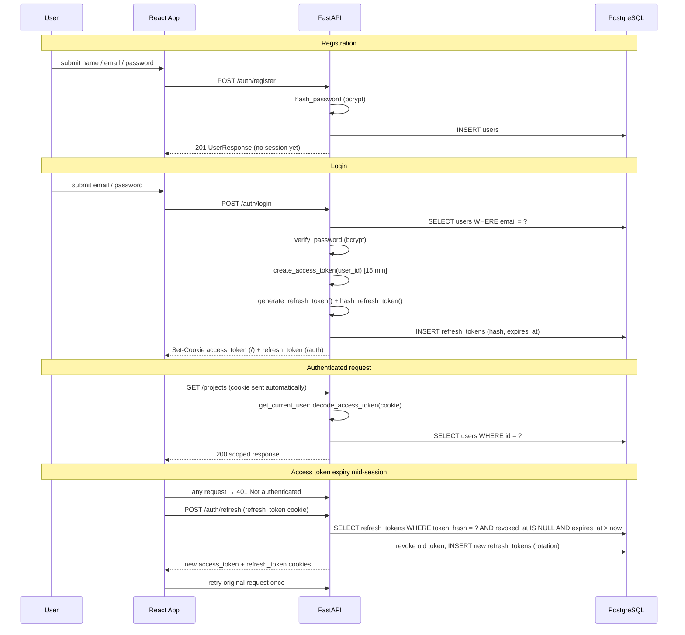

**Refresh token rotation** means every successful `/auth/refresh` call revokes the token it was given and issues a brand-new one — a stolen refresh token can be used exactly once before the legitimate client's next refresh silently invalidates it (the attacker's copy fails at `revoked_at IS NULL`).

**Frontend single-flight refresh:** `client.ts`'s Axios response interceptor and `streamChat.ts`'s raw-`fetch` SSE client both call the *same* `refreshAccessToken()` function, which de-duplicates concurrent refresh attempts behind one in-flight promise. Without this, five parallel 401s (e.g., a page that fires several requests on mount) would race five separate refresh calls, and refresh-token rotation means only the first would succeed — the rest would log the user out.

**Authorization = ownership, not roles.** There are no roles or permission scopes in this system — every protected resource (`Project`, `Document`, `ChatMessage`) is scoped by `user_id` (directly, or transitively through `project_id`), enforced at the repository query level (`WHERE project_id = ? AND user_id = ?`), never in application code after the fact.

---

## 7. Complete RAG Architecture

Retrieval is **query-adaptive**, not unconditional — most of the pipeline's engineering effort goes into deciding *whether* and *what* to retrieve before spending a vector search, an LLM call, or 400ms on cross-encoder reranking.

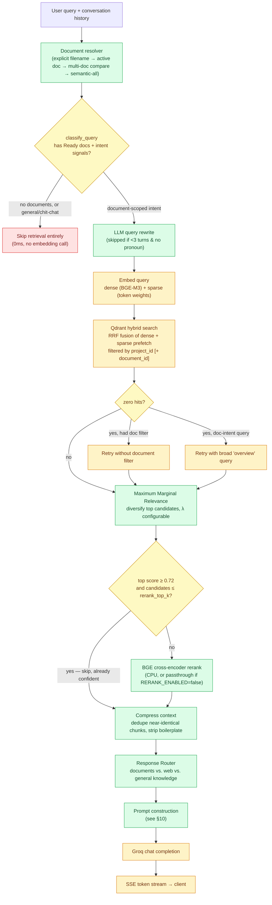

**Stage-by-stage rationale:**

| Stage | Implementation | Why it exists |
|---|---|---|
| Document resolver | `document_context_resolver.py` — regex priority ladder: explicit filename mention → multi-doc "compare both" phrasing → pronoun/deictic reference to the *active* document → project's single active document → no filter (semantic across all) | Chat is single-thread per project (no conversation switcher), so "summarize **this** document" is ambiguous without conversation state. Resolving it *before* the vector search means retrieval can be scoped with a Qdrant metadata filter instead of relying on embedding similarity alone. |
| Query classification | `query_classifier.py` — regex signal sets for document intent vs. general/coding chit-chat | Skips embedding + Qdrant entirely for `"hello"`, `"write a bubble sort in Rust"`, etc. — zero retrieval latency for the common non-document turn. |
| Query rewrite | `llm_query_rewriter.py` — Groq fast model, skipped unless history ≥ 3 turns *or* a deictic word (`this`, `it`, `that`, …) is present | A fast Groq call (~50–150ms) only when a follow-up genuinely needs conversational context to stand alone as a search query (e.g., "what about its limitations?"). |
| Hybrid search | `qdrant_store.py` — dense (`BAAI/bge-*`) + sparse (token-weight) vectors fused via Qdrant's native RRF (`Fusion.RRF`) | Dense vectors catch semantic similarity; sparse vectors catch exact keyword/acronym matches dense embeddings can miss (e.g., product codes, proper nouns). RRF fusion needs no manual score normalization. |
| MMR | `mmr.py` — greedy selection maximizing `λ·relevance − (1−λ)·max_similarity_to_selected` | Vector search alone returns near-duplicate chunks from repetitive documents (headers, boilerplate paragraphs). MMR trades a little top-1 relevance for diversity across the context window. |
| Conditional rerank | `bge_reranker.py` (`CrossEncoder`), skipped when the top hit already scores ≥ 0.72 and few candidates remain | Cross-encoder reranking is the single most expensive stage (50–400ms CPU). Skipping it on high-confidence matches is a deliberate latency/quality trade-off validated by score thresholds, not a blanket disable. |
| Context compression | `context_compressor.py` — strips boilerplate (`"Page X of Y"`, copyright lines) and near-duplicate prefixes | Keeps the prompt's context budget spent on unique information, not repeated PDF headers. |
| Response routing | `response_router.py` — see [§9](#9-chat-message-flow) | Decides *after* retrieval whether the retrieved chunks actually answer the question, and if not, whether to fall back to live web search or general knowledge — see next section. |

---

## 8. Document Ingestion Pipeline

Upload is synchronous (validate, store, create the DB row); everything CPU/GPU-bound happens on the Arq worker so the HTTP response returns in milliseconds regardless of document size.

```mermaid
flowchart LR
    Upload["POST /projects/{id}/documents<br/>multipart file"]
    Upload --> Cap["Capped read<br/>(rejects mid-stream if over size limit)"]
    Cap --> Mime["MIME sniff<br/>(magic bytes, not just extension)"]
    Mime --> Guard["Guardrails: upload decision service<br/>(content policy pre-check, may require confirmation)"]
    Guard --> Persist["Document row: status = processing"]
    Persist --> Store["Save original bytes<br/>local filesystem /{project_id}/{document_id}_{filename}"]
    Store --> Enqueue["Enqueue Arq job: process_document(doc_id)"]
    Enqueue --> Return["201 response — filename, status=processing"]

    Enqueue -.->|"Redis dequeue"| WorkerBox

    subgraph WorkerBox["Background: IngestionService.ingest() (Arq worker process)"]
        direction TB
        Extract["Extract text<br/>PDF (pypdf) · DOCX (python-docx) · TXT/MD"]
        ChunkStep["Semantic chunking<br/>heading-aware, ~600 char target, 1200 char max"]
        EmbedStep["Batch embed chunks<br/>dense + sparse vectors"]
        Upsert["Qdrant upsert<br/>(chunk_id shared with Postgres row)"]
        SaveChunks["Postgres: DocumentChunk rows<br/>(content, page, heading, qdrant_point_id)"]
        Ready["Document.status = ready<br/>chunk_count set, active_document_id updated"]
        Extract --> ChunkStep --> EmbedStep --> Upsert --> SaveChunks --> Ready
    end

    Ready -.->|"polled every 3s while processing"| FE["Frontend: useProjectDocuments"]

    classDef api fill:#dbeafe,stroke:#2563eb,color:#1e3a8a
    classDef worker fill:#dcfce7,stroke:#16a34a,color:#14532d
    classDef store fill:#ede9fe,stroke:#7c3aed,color:#4c1d95

    class Upload,Cap,Mime,Guard,Persist,Return api
    class Extract,ChunkStep,EmbedStep,Upsert,SaveChunks,Ready worker
    class Store store
```

**Dual storage, single identity.** Every chunk's vector lives in Qdrant (for search) and its text/metadata lives in `document_chunks` in Postgres (for audit, debugging, and re-display) — both keyed by the *same* UUID (`chunk_id` == `qdrant_point_id`). There's no separate ID mapping table; the UUID is the join key.

**Failure handling is fail-closed, not silent-degrade in production.** If Redis is unreachable when a document is uploaded, `enqueue_document_ingestion` raises `IngestionQueueUnavailableError` unless `INGESTION_INLINE_FALLBACK=true` (which the production config validator explicitly forbids — see [§17](#17-security-architecture)). The document is marked `failed` with a clear message ("start Redis and the worker, then reprocess") rather than silently running embedding inline inside the API process and blocking a request thread.

**Retry policy distinguishes permanent failures from transient ones.** `IngestionService` classifies exceptions: `"no extractable text"`, `"scan or image"`, `"chunking produced no chunks"`, and `"unsupported file type"` are **non-retryable** (mark `failed` immediately — retrying won't fix a scanned image PDF). Everything else increments `retry_count` and re-raises, letting Arq's built-in retry mechanism requeue the job, up to `INGESTION_MAX_RETRIES` (default 3). Separately, `DocumentService.list_documents_with_recovery` re-queues any document stuck in `processing` for longer than `INGESTION_STALE_MINUTES` — a defense against a worker crashing mid-job and leaving an orphaned row.

---

## 9. Chat Message Flow

The streaming path (`chat_stream`) is the primary UX; the non-streaming path (`chat`) shares the same context-preparation code and exists for simpler clients / testing.

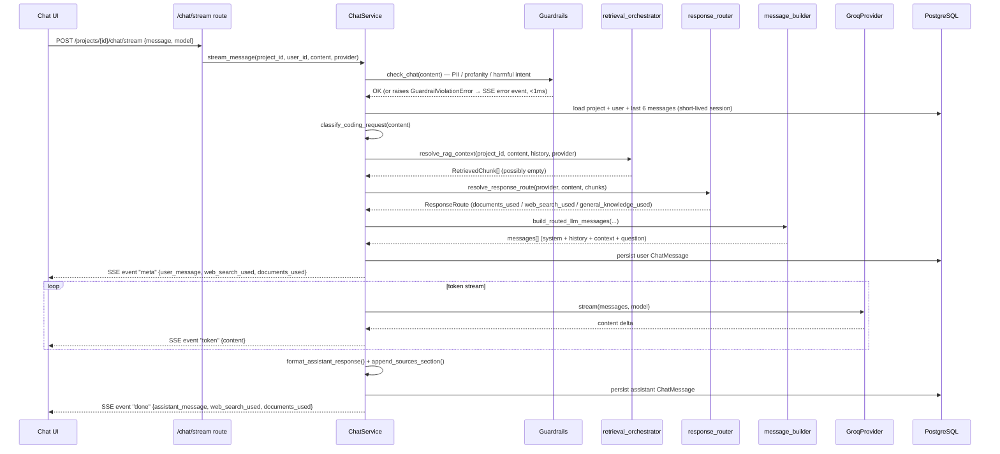

**Response routing decision matrix** (`response_router.resolve_response_route`) — the core logic that keeps answers grounded:

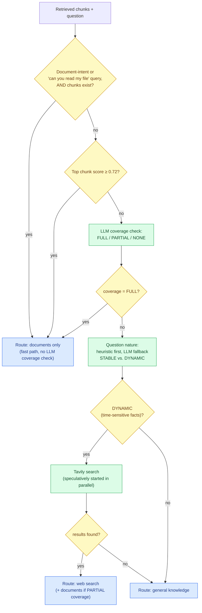

Every routed response ends with a **"Sources Used" footer** (`📄 Uploaded Documents` / `🧠 General Knowledge` / `🌐 Internet`), generated deterministically from the route decision, not by asking the LLM to self-report — this guarantees the footer is always accurate to what was actually retrieved.

---

## 10. Prompt Construction Pipeline

The system prompt is assembled in layers, each appended only when relevant, so the LLM sees a coherent instruction set rather than several competing "system prompts" concatenated blindly.

```mermaid
flowchart TB
    A["1 · Project identity<br/>Project.system_prompt + Project.description"]
    A --> B["2 · Response-depth instructions<br/>brief / standard / comprehensive<br/>(classified from message + coding intent)"]
    B --> C["3 · Formatting rules<br/>GitHub-flavored Markdown, table/list conventions"]
    C --> D["4 · Coding instructions (conditional)<br/>only if classify_coding_request() detects a code task"]
    D --> E["5 · Safety instructions<br/>refuse harmful/illegal, don't echo PII"]
    E --> F["6 · Document policy + RAG synthesis rules (conditional)<br/>only if retrieval returned chunks"]
    F --> G["7 · Routing instructions (conditional)<br/>documents-only / web / general-knowledge / mixed / document-access"]
    G --> H["8 · Retrieval-degraded note (conditional)<br/>only if RAG failed but Ready documents exist"]
    H --> I["── system message assembled ──"]

    I --> J["+ last 6 messages of conversation history"]
    J --> K["+ current turn:<br/>Context: {doc chunks}<br/>Web search results: {Tavily snippets}<br/>Question: {user message}"]
    K --> L["Final messages[] → Groq chat completion"]

    classDef layer fill:#dcfce7,stroke:#16a34a,color:#14532d
    classDef conditional fill:#fef9c3,stroke:#ca8a04,color:#713f12
    classDef final fill:#dbeafe,stroke:#2563eb,color:#1e3a8a

    class A,B,C,E layer
    class D,F,G,H conditional
    class I,J,K,L final
```

`message_builder.py` implements this as two near-identical functions — `build_llm_messages` (legacy, used when `RESPONSE_ROUTING_ENABLED=false`) and `build_routed_llm_messages` (used when routing is on, which layers 6–8 and the sources footer depend on). Both guard document excerpts and web snippets in `<untrusted_document>` / `<untrusted_web>` tags with an explicit instruction to treat their contents as data, not instructions — a lightweight prompt-injection defense against a malicious PDF or search result trying to hijack the system prompt.

---

## 11. Conversation Memory Flow

There is **no separate "Conversation" entity** — each `Project` has exactly one continuous message timeline (`ChatMessage.project_id`). This is a deliberate simplification: a project already *is* a scoped context (its own system prompt, its own documents), so a second layer of conversation-switching inside a project would duplicate that scoping without adding value for this product's use case.

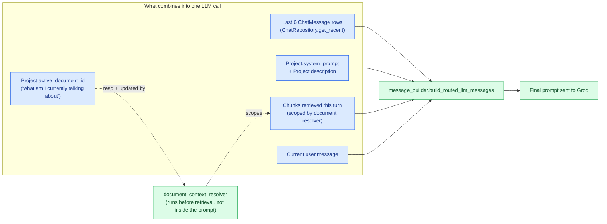

**`active_document_id` is conversational state, not a RAG index toggle.** It answers "which document is the user currently focused on" so that a follow-up like *"what about its conclusion?"* resolves to the right document without the user repeating its name. It is updated in two cases: (1) the user explicitly names a single document (`explicit_reference`), or (2) the user uses a deictic reference (*"this document"*) with no document currently active, in which case the most recently uploaded ready document becomes active (`contextual_latest`). It is *not* touched by ordinary semantic queries that don't mention a document at all.

**Why only 6 messages of history?** `HISTORY_MESSAGE_LIMIT = 6` in both `message_builder.py` (prompt assembly) and `ChatRepository.DEFAULT_HISTORY_LIMIT` (DB fetch) bounds prompt size predictably — a chat that's been running for 200 turns still produces a prompt of roughly the same token count as one 6 turns in. The *full* history remains queryable via the paginated `GET /projects/{id}/messages` endpoint (used only to render the chat UI on page load, backed by the CQRS-lite `MessageReadRepository`), completely decoupled from what the LLM sees per turn.

---

## 12. Database Relationships

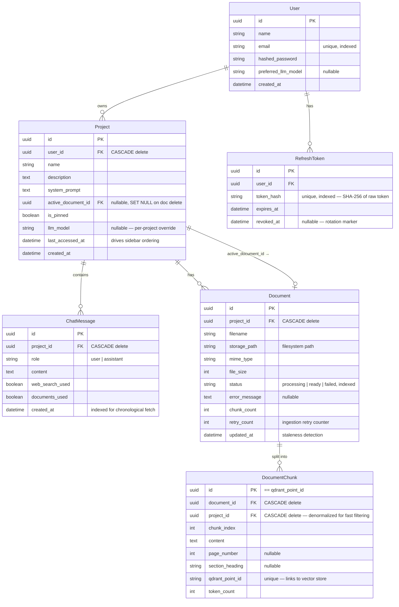

**Notably absent: a `Conversation` table.** Chat threading is intentionally flat — see [§11](#11-conversation-memory-flow) for why. **Notably absent: a `prompts` library table.** Unlike systems that store a separate reusable "prompt" resource, this platform treats `Project.system_prompt` and `Project.description` as the single source of prompt truth; there's no indirection to manage.

**`Project.active_document_id` is a self-referential-adjacent, nullable foreign key with `ON DELETE SET NULL`** — deleting the active document doesn't cascade-delete the project, it just clears the pointer (and `DocumentService.delete_document` immediately re-points it to the next most recent Ready document, so the "current focus" concept degrades gracefully rather than dangling).

Schema evolution is entirely Alembic-managed, ten linear migrations with no down-time DDL surprises:

| Migration | Change |
|---|---|
| `001_create_users` | Base `users` table |
| `002_create_refresh_tokens` | Refresh-token rotation support |
| `003_create_projects` | `projects` table |
| `004_add_web_search_used` | `chat_messages.web_search_used` flag |
| `005_chat_msg_composite_idx` | Composite index for chronological project-scoped fetch |
| `006_create_documents` | `documents` + `document_chunks` tables (RAG) |
| `007_documents_status_idx` | Composite index on `(project_id, status, updated_at)` for stale-job recovery |
| `008_project_active_document` | `projects.active_document_id` (conversational document focus) |
| `009_project_pin_and_last_accessed` | Sidebar ordering support |
| `010_llm_model_preferences` | Per-project and per-user model overrides |

---

## 13. Data Flow Diagram

How a single piece of information — a user's uploaded PDF — actually moves through every layer of the system, from bytes on disk to tokens in a prompt.

```mermaid
flowchart LR
    File["📄 Original PDF<br/>(browser File object)"]
    File -->|"multipart/form-data"| API["FastAPI route<br/>(capped read, MIME sniff)"]
    API -->|"raw bytes"| FS[("Filesystem<br/>/{project_id}/{doc_id}_name.pdf")]
    API -->|"metadata row"| PG1[("Postgres: documents<br/>status=processing")]
    API -->|"job payload: document_id"| Redis[("Redis queue")]

    Redis -->|"dequeue"| Worker["Arq Worker"]
    FS -->|"read bytes"| Worker
    Worker -->|"extracted text"| Chunker["Semantic chunker"]
    Chunker -->|"text chunks"| Embedder["Embedding provider"]
    Embedder -->|"dense + sparse vectors"| Qdrant[("Qdrant<br/>vector + payload")]
    Chunker -->|"chunk text + metadata"| PG2[("Postgres: document_chunks")]
    Worker -->|"status=ready"| PG1

    Qdrant -->|"vector search results"| Retriever["HybridRetriever<br/>(future chat turns)"]
    Retriever -->|"RetrievedChunk[]"| Prompt["Prompt assembly"]
    Prompt -->|"messages[]"| Groq["Groq LLM"]
    Groq -->|"streamed tokens"| SSE["SSE → browser"]
    Prompt -.->|"chunk text (audit trail)"| PG2

    classDef origin fill:#dbeafe,stroke:#2563eb,color:#1e3a8a
    classDef backend fill:#dcfce7,stroke:#16a34a,color:#14532d
    classDef store fill:#ede9fe,stroke:#7c3aed,color:#4c1d95
    classDef external fill:#fef3c7,stroke:#d97706,color:#78350f

    class File origin
    class API,Worker,Chunker,Embedder,Retriever,Prompt backend
    class FS,PG1,PG2,Redis,Qdrant store
    class Groq,SSE external
```

The same document's text physically exists in three places by design: the **original bytes** on disk (recoverable source of truth, re-processable), **chunk text in Postgres** (for the app to display/audit what was indexed without querying the vector DB), and **vectors + a payload copy of the text in Qdrant** (so a search result is self-contained and doesn't require a Postgres round-trip to render).

---

## 14. Project Isolation

Multi-tenancy is enforced at three independent layers — a bug in one does not expose data through another.

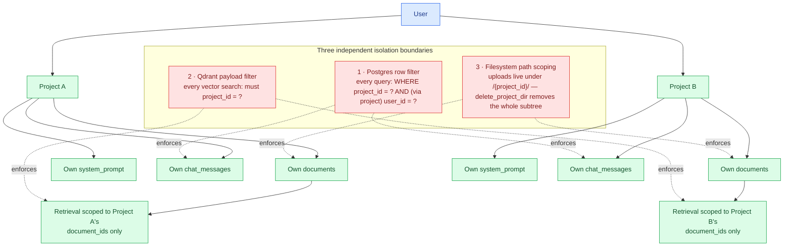

**Deleting a project cascades cleanly across all three layers**: `ProjectService.delete_project` deletes each document's file from disk, calls `vector_store.delete_project(project_id)` to purge every Qdrant point tagged with that `project_id`, then deletes the Postgres row — which `ON DELETE CASCADE` propagates to `chat_messages`, `documents`, and `document_chunks` automatically. Qdrant cleanup failure is caught and logged rather than blocking the Postgres delete (a project the user asked to delete should disappear from their view even if the vector store is briefly unreachable — a scheduled reconciliation job is a natural next step, not yet implemented).

---

## 15. Voice Pipeline

**Not implemented — intentionally omitted.** A voice input feature (browser microphone capture → speech-to-text → existing chat pipeline) was prototyped and then **fully removed** from this codebase after evaluation: the added client-side complexity (media permissions, recorder lifecycle, mobile Safari quirks) and a third external vendor dependency were judged not worth the UX gain relative to the core RAG/chat experience for this stage of the product. There is no microphone capture, no speech-to-text integration, and no audio-related route, service, or component in the current tree — including this section as "not implemented" rather than silently skipping it is a deliberate choice: it documents a decision, not an oversight.

---

## 16. External Service Integration

Every external dependency sits behind an abstract interface (`app/providers/base.py` or `app/services/llm_provider.py`) so the concrete vendor is a swappable implementation detail, not something orchestration code depends on directly.

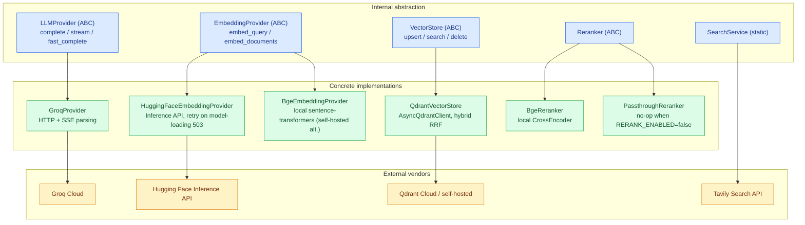

| Service | Role | Selected via | Failure behavior |
|---|---|---|---|
| **Groq** | Chat completion (streaming + fast classification calls) | `dependencies/llm.py` (singleton) | Missing API key is a hard startup failure in production (`enforce_production_security`) |
| **Hugging Face Inference API** | Query + document embeddings (default) | `EMBEDDING_PROVIDER=huggingface` | Retries on `503`/`524` (model cold-start) with exponential backoff; raises after `HUGGINGFACE_MAX_RETRIES` |
| **Local BGE (sentence-transformers)** | Self-hosted embedding alternative — no external API call | `EMBEDDING_PROVIDER=local` | N/A — runs in-process, trades API latency for CPU/RAM footprint |
| **Qdrant** | Hybrid vector index | `QDRANT_URL` / `QDRANT_API_KEY` | RAG retrieval catches all exceptions and degrades to "no context" rather than 500ing the whole chat turn (`retrieval_degraded` flag informs the LLM to say so honestly) |
| **Tavily** | Web search for dynamic/time-sensitive questions | `TAVILY_API_KEY` | Missing key → search silently returns `[]`; response router falls back to general-knowledge routing |

---

## 17. Security Architecture

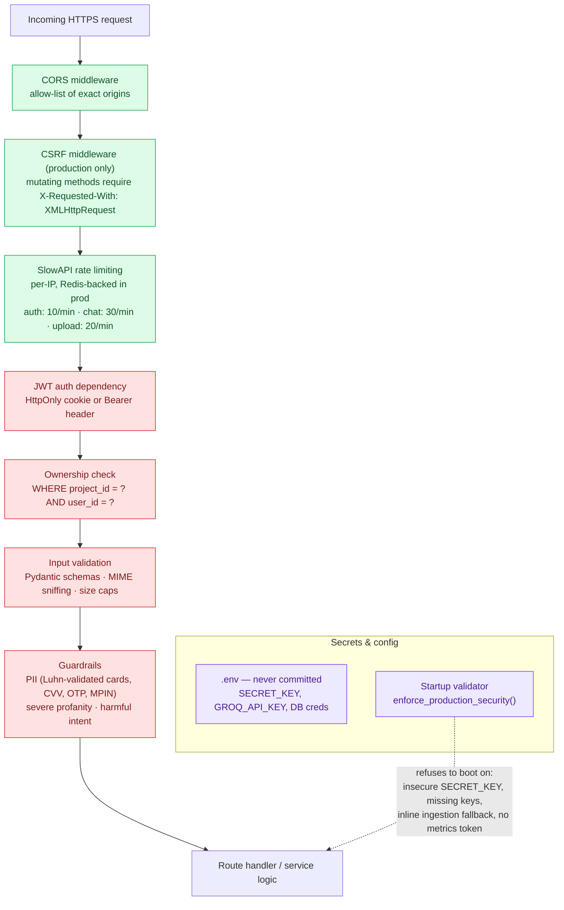

| Layer | Mechanism | Detail |
|---|---|---|
| **Transport** | HTTPS everywhere (Vercel + Render both terminate TLS); `secure=True` cookies in production | Cookies are also `HttpOnly` (no JS access) and `SameSite`-configured |
| **CSRF** | Custom middleware, production-only | Requires `X-Requested-With: XMLHttpRequest` on `POST/PUT/PATCH/DELETE` — a cross-site form post can set cookies but cannot set arbitrary headers, so this blocks classic CSRF without needing per-request tokens |
| **Authentication** | JWT access token (15 min) + rotating opaque refresh token (7 days, SHA-256 hashed at rest) | See [§6](#6-authentication-flow) |
| **Authorization** | Ownership-based, enforced in the repository query itself | No role system exists or is needed — every resource has exactly one owner |
| **Input validation** | Pydantic schemas for every request body; `detect_mime()` sniffs magic bytes (doesn't trust `Content-Type` or file extension); capped streaming read rejects oversized uploads before fully buffering them | Prevents disguised-extension attacks and memory-exhaustion uploads |
| **Guardrails** | Regex + Luhn-validated PII detection, severe-profanity blocklist with obfuscation normalization, harmful-intent patterns — all pure-Python, no LLM call, sub-millisecond | Runs *before* any retrieval or LLM spend — a blocked message costs nothing beyond a regex pass |
| **Prompt-injection mitigation** | Retrieved document/web content wrapped in `<untrusted_document>` / `<untrusted_web>` tags with explicit "treat as data, not instructions" framing | Reduces (does not eliminate) the risk of a malicious PDF or search result hijacking the system prompt |
| **Rate limiting** | SlowAPI, per-IP, Redis-backed store in production (`RATE_LIMIT_USE_REDIS`) | Prevents a single client from exhausting Groq/embedding budget or brute-forcing login |
| **Secrets** | `.env` files git-ignored; `Settings` (Pydantic) reads from environment; a `model_validator` (`enforce_production_security`) **refuses to start the process** in production if `SECRET_KEY` is a known placeholder, `GROQ_API_KEY` is missing, `INGESTION_INLINE_FALLBACK` is enabled, `/metrics` has no bearer token, or rate limiting isn't Redis-backed | Security misconfiguration becomes a boot-time crash, not a runtime surprise discovered after a breach |
| **Observability protection** | `/metrics` requires `Authorization: Bearer {METRICS_TOKEN}` in production | Prevents unauthenticated scraping of internal request/latency data |

---

## 18. Error Handling Flow

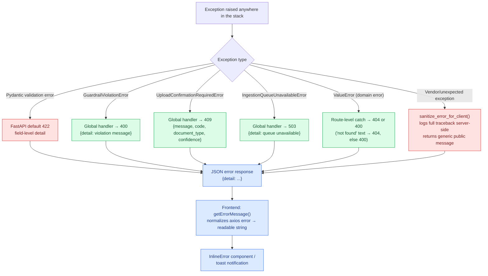

**Never leak vendor internals to the client.** `sanitize_error_for_client()` always logs the full exception server-side (`logger.exception`) but returns a generic message (`GENERIC_LLM_ERROR`, `GENERIC_OPTIMIZE_ERROR`, …) for anything that isn't a deliberately-raised `ValueError` — a Groq 500, a Qdrant timeout, or a stack trace never reaches the browser. The one exception is `ValueError`, which is used throughout the service layer specifically *for* messages that are safe and useful to show the user (e.g., `"File exceeds maximum size of 25 MB"`).

**The frontend has a second normalization pass.** `getErrorMessage()` in `client.ts` distinguishes network failures (`"Cannot reach the server..."`), timeouts (`"Upload timed out..."`), and 5xx responses (`"Server error. Check that PostgreSQL is running..."`) — giving actionable messages during local development — from parsed `detail` payloads in production. It even unwraps a specific pattern (`Groq API error (429): {...json...}`) to surface just the inner vendor message instead of a raw stringified JSON blob.

---

## 19. Component Interaction

A cross-cutting view of how the four architectural layers actually call each other at runtime — useful for spotting the rule this codebase enforces: **calls only flow downward (or laterally within a layer); nothing skips a layer.**

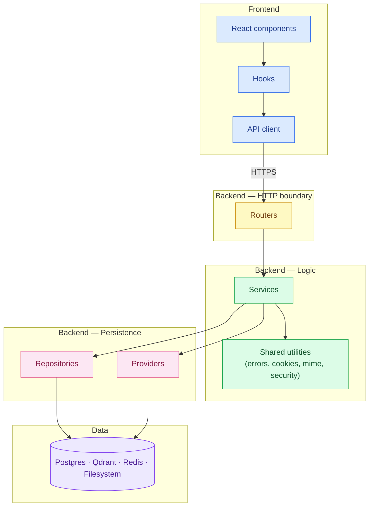

Concretely, this rule means: **components never call `fetch` directly** (always through a hook → `api/*.ts` module); **routers never construct SQL or call `httpx` directly** (always through a service); **services never import `sqlalchemy` query builders inline for anything beyond a one-off ownership check** (repositories own query construction). The one deliberate exception is `ChatService`'s short-lived-session helpers (`_load_context`, `_persist_message`), which open a `Session` directly rather than depending on a request-scoped one — a documented trade-off explained in [§5](#5-request-lifecycle).

---

## 20. Complete User Journey

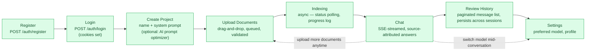

Every step after login persists immediately and independently — there is no "session" concept beyond authentication; closing the browser and returning a week later restores the exact project list, chat history, and document set because none of it is held in memory or a temporary session store.

---

## 21. Folder Structure

```
chatbot/
├── backend/
│   └── app/
│       ├── main.py                  # FastAPI app, middleware chain, health/metrics endpoints
│       ├── config.py                # Pydantic Settings — env vars, production validators
│       ├── database.py              # SQLAlchemy engine/session, Base, health check
│       │
│       ├── routes/                  # HTTP boundary only — no business logic
│       │   ├── auth.py              #   register / login / refresh / logout
│       │   ├── users.py             #   /users/me — profile, model preference
│       │   ├── projects.py          #   CRUD, chat, chat/stream, messages, prompt optimizer
│       │   ├── documents.py         #   upload, list, reprocess, delete
│       │   ├── exports.py           #   Markdown/PDF/DOCX export of a chat answer
│       │   └── models.py            #   list of selectable Groq models
│       │
│       ├── dependencies/            # FastAPI DI providers
│       │   ├── auth.py              #   get_current_user (cookie or Bearer)
│       │   ├── llm.py                #   get_llm_provider (GroqProvider singleton)
│       │   └── prompt_optimization.py
│       │
│       ├── services/                 # All business logic — orchestration, no SQL
│       │   ├── auth.py               #   register/login/refresh/session logic
│       │   ├── chat_service.py        #   turn orchestration, streaming, short-lived sessions
│       │   ├── retrieval_orchestrator.py  # document filter resolution + retriever invocation
│       │   ├── response_router.py     #   documents/web/general-knowledge decision
│       │   ├── message_builder.py     #   layered system-prompt + message[] assembly
│       │   ├── document_context_resolver.py # "which document does this query mean"
│       │   ├── search_orchestrator.py / search_service.py # Tavily decision + caching
│       │   ├── document_service.py / ingestion_service.py / ingestion_queue.py
│       │   ├── project_service.py
│       │   ├── coding_intent.py / response_depth.py / query_classifier.py / routing_heuristics.py
│       │   ├── model_resolver.py     #   request → project → user → default model priority
│       │   └── groq_provider.py / groq_prompt_optimization_provider.py
│       │
│       ├── providers/                # Swappable external-system abstractions
│       │   ├── base.py               #   ABCs: EmbeddingProvider, VectorStore, Chunker, ...
│       │   ├── types.py              #   shared dataclasses (RetrievedChunk, ChunkPayload, ...)
│       │   └── impl/                 #   Qdrant, HF/local embeddings, BGE reranker,
│       │                              #   semantic chunker, PDF/DOCX parser, hybrid retriever
│       │
│       ├── models/                   # SQLAlchemy ORM entities (write side)
│       ├── read_models/              # CQRS-lite read DTOs (MessageReadModel)
│       ├── repositories/             # All SQL — one class per aggregate
│       ├── schemas/                  # Pydantic request/response contracts
│       │
│       ├── guardrails/               # PII, profanity, harmful-intent regex detectors
│       ├── upload_validation/        # Pre-ingestion content-policy check for uploads
│       ├── workspace_export/         # Export-format renderers (MD/PDF/DOCX)
│       ├── observability/            # Prometheus metrics, OpenTelemetry tracing
│       ├── utils/                    # cookies, security (JWT/bcrypt), mime, rate limit,
│       │                              # error sanitization, file storage, SSE serialization
│       └── workers/                  # Arq WorkerSettings — ingestion job entrypoint
│
├── frontend/
│   └── src/
│       ├── pages/                    # Route-level components (Landing, Login, Home, Chat, Settings)
│       ├── components/               # Presentational — chat/, layout/, auth/, projects/, ui/
│       ├── hooks/                    # useChatStream, useProjectDocuments, useChatAutoScroll
│       ├── contexts/                 # AuthContext, ProjectsContext, ThemeContext, ToastContext
│       ├── api/                      # client.ts (axios), streamChat.ts (SSE), per-domain modules
│       ├── types/                    # Shared TypeScript contracts, mirroring backend schemas
│       ├── utils/                    # Markdown repair, formatting, storage helpers
│       └── config/                   # Available models, API base URL, CSRF headers
│
├── deploy/                           # render.yaml (Blueprint), DEPLOYMENT.md
├── docs/                             # This document, screenshots
└── docker-compose.yml                # Local Postgres + Redis (+ optional Qdrant profile)
```

Each backend package answers exactly one question: `routes` — *what HTTP shape does this expose?*; `services` — *what should happen?*; `repositories` — *how is it persisted?*; `providers` — *which vendor implements this capability?* A new engineer can trace any feature top-down through these four questions without needing to read the whole tree.

---

## 22. Technology Decision Map

```mermaid
flowchart TB
    subgraph BackendChoices["Backend"]
        FastAPI["FastAPI"]
        Postgres["PostgreSQL 16"]
        Redis["Redis 7"]
        Qdrant["Qdrant"]
        Arq["Arq"]
    end
    subgraph FrontendChoices["Frontend"]
        React["React 19 + Vite"]
    end
    subgraph AIChoices["AI"]
        Groq["Groq"]
    end
    subgraph OpsChoices["Ops"]
        Docker["Docker Compose"]
        Vercel["Vercel"]
        Render["Render"]
    end

    classDef tech fill:#dcfce7,stroke:#16a34a,color:#14532d
    class FastAPI,Postgres,Redis,Qdrant,Arq,React,Groq,Docker,Vercel,Render tech
```

| Technology | Alternatives considered | Why this one | Trade-off accepted |
|---|---|---|---|
| **FastAPI** | Django REST, Flask, Node/Express | Native `async`/`await` for I/O-bound LLM/embedding calls; Pydantic gives request validation and OpenAPI docs for free; type hints double as documentation | Smaller ecosystem than Django for things this app doesn't need (admin panel, ORM batteries) |
| **PostgreSQL** | MySQL, SQLite | Relational integrity for a strictly relational domain (users → projects → messages/documents); mature, boring, well-understood | Vector search is delegated to Qdrant rather than using `pgvector` in the same database — see next row |
| **Qdrant (dedicated vector DB)** | `pgvector` in Postgres, Pinecone, Weaviate | Native hybrid dense+sparse search with built-in RRF fusion, and payload filtering that scales independently of the relational workload | A second database to operate, deploy, and monitor — accepted because retrieval quality (hybrid search) mattered more than operational simplicity for this feature set |
| **Redis + Arq** | Celery + RabbitMQ, in-process `BackgroundTasks` | Arq is asyncio-native (matches FastAPI's event loop model) and lightweight; Redis is already needed for rate limiting, so it's not an extra piece of infrastructure | Celery has a larger ecosystem/monitoring tooling; Arq's simplicity was preferred at this scale |
| **React 19 + Vite** | Next.js, Vue, plain SPA templates | This is a pure client-rendered dashboard app behind auth — no SEO requirement that would justify SSR; Vite's dev-server speed and simple static-export deploy model fit a Vercel-hosted SPA exactly | No server components, no built-in API routes (not needed — FastAPI is the API) |
| **Groq** | OpenAI, Anthropic, self-hosted vLLM | Inference speed (critical for the streaming UX and for the several "fast classification" calls per turn — coverage check, nature check, search decision, query rewrite) at a cost point that makes 3–5 auxiliary LLM calls per turn economically viable | Smaller model catalog than OpenAI/Anthropic; primary/fallback model selection is user-configurable to hedge this |
| **Hugging Face Inference API (default) / local BGE (alt.)** | OpenAI embeddings | Open-weight BGE models avoid per-token embedding cost at RAG scale (every chunk of every document, every query); the provider abstraction keeps a fully local/offline path available for cost or latency reasons | HF Inference API cold-starts (503) require retry logic; local BGE trades that for CPU/RAM on the API host |
| **Docker Compose (dev) / Render Blueprint (prod)** | Manual local setup, Kubernetes | One `docker-compose up` reproduces Postgres + Redis for any contributor; Render Blueprints (`render.yaml`) give declarative, version-controlled infrastructure without Kubernetes' operational overhead for a project this size | No autoscaling sophistication of k8s — acceptable trade-off until traffic demands otherwise |
| **Vercel (frontend) / Render (backend)** | Single host for everything | Splitting lets the static frontend live on a global CDN (cheap, fast, zero server management) while the backend — which needs a long-lived process for streaming and a private network to Postgres/Redis — lives where that's natively supported | Two deployment pipelines to keep in sync (mitigated by strict `VITE_API_URL` / `CORS_ORIGINS` contracts) |
| **Modular monolith (not microservices)** | Splitting auth/chat/documents into separate services | One process, one deploy, no network hop between "services" that always change together at this team size; the ingestion worker is the *one* piece pulled out, specifically because its resource profile (CPU-bound embedding) is genuinely different from request/response latency needs | Cannot independently scale, e.g., the auth path from the chat path — not yet a real constraint |

---

## 23. Latency & Performance Flow

Real measurements from `logger.info` timing statements already present in the code (`retrieval_orchestrator.py`, `hybrid_retriever.py`, `ingestion_service.py`, `chat_service.py`) plus the Prometheus histograms exported at `/metrics` (`CHAT_CONTEXT_DURATION`, `CHAT_TTFT`, `RAG_DURATION`).

```mermaid
flowchart TB
    subgraph ChatPath["Chat turn — sequential latency budget"]
        direction LR
        Auth["JWT decode<br/>1–5ms"] --> GuardT["Guardrails<br/>&lt;1ms"]
        GuardT --> LoadCtx["Load context (DB)<br/>5–30ms"]
        LoadCtx --> Rewrite["Query rewrite (Groq)<br/>50–200ms · cacheable · skippable"]
        Rewrite --> EmbedT["Embed query<br/>20–150ms · cacheable"]
        EmbedT --> Search["Qdrant hybrid search<br/>10–80ms"]
        Search --> RerankT["Rerank (conditional)<br/>50–400ms · often skipped"]
        RerankT --> Coverage["Coverage + nature LLM calls<br/>50–200ms each · parallelized"]
        Coverage --> TavilyT["Tavily (if dynamic)<br/>200–800ms · parallelized, cached"]
        TavilyT --> Persist["Persist user message<br/>5–20ms"]
        Persist --> TTFT["Groq TTFT<br/>200–800ms"]
    end
    TTFT --> Stream["Token stream<br/>2–30s total, perceived latency ≈ TTFT"]

    classDef fast fill:#dcfce7,stroke:#16a34a,color:#14532d
    classDef slow fill:#fef9c3,stroke:#ca8a04,color:#713f12
    class Auth,GuardT,LoadCtx,EmbedT,Search,Persist fast
    class Rewrite,RerankT,Coverage,TavilyT,TTFT,Stream slow
```

| Stage | Latency | Optimization applied |
|---|---|---|
| Guardrails | <1ms | Pure regex, no LLM/network call — runs before any expensive work |
| Query classification | <1ms | Local heuristics skip retrieval entirely for non-document queries |
| Query rewrite | 50–200ms | **Skipped** unless history is deep enough or a deictic word is present |
| Embedding | 20–150ms | Query embeddings are the one per-turn call that can't be skipped when retrieval is needed |
| Qdrant search | 10–80ms | Hybrid RRF fusion in a single round-trip (not two sequential searches) |
| Reranking | 50–400ms | **Skipped** when the top hit already scores ≥ 0.72 — the most expensive stage avoided on the common high-confidence case |
| Coverage + nature checks | 50–200ms each | Run as fast, cheap Groq calls (`fast_complete`, ≤8 tokens), and the Tavily search is **started speculatively in parallel** with the nature classification when a heuristic already suggests "dynamic" — hiding its latency instead of paying it sequentially |
| Tavily search | 200–800ms | 10-minute TTL cache (`TTLCache`) — repeated or similar questions in the same window are free |
| Answer generation | TTFT 200–800ms, then streamed | Streaming means the user sees the *first* token in under a second even though full generation takes seconds — perceived latency, not total latency, is what's optimized |

**Frontend-side latency work:** token rendering is batched via `requestAnimationFrame` in `useChatStream` rather than triggering a React re-render per SSE token (which, at high token rates, would thrash the DOM); document upload progress is milestone-throttled (logs at 25/50/75/100%, not every progress event) to avoid re-rendering the activity log dozens of times per second; heavy chat-only dependencies are not eagerly bundled into the initial landing-page load (route-level code splitting via React Router's lazy patterns keeps the public marketing pages light).

**Ingestion latency is logged per-stage** (`extract_ms`, `chunk_ms`, `embed_ms`, `qdrant_ms` in `ingestion_service.py`), which is what made it possible to identify that embedding dominates total ingestion time for large documents — informing the decision to batch embedding requests (`HUGGINGFACE_EMBEDDING_BATCH_SIZE`) rather than embedding one chunk per HTTP call.

---

## 24. Design Principles

**Separation of concerns.** Four strict layers (routes → services → repositories/providers → data), enforced by convention and reviewed in every PR: a router never writes SQL; a service never returns an ORM entity across the read boundary (see the `MessageReadModel` CQRS-lite pattern in [§11](#11-conversation-memory-flow)); a repository never contains business rules.

**Modularity through abstraction, applied selectively.** Every genuinely-swappable dependency — LLM backend, embedding model, vector store, reranker, document parser, chunker, query rewriter — sits behind an ABC in `providers/base.py`. Things that are *not* realistically swappable (the SQL database itself, the web framework) don't get speculative interfaces; the codebase avoids the trap of "abstract everything" that adds indirection without a second implementation ever arriving.

**Scalability along the axis that actually needs it.** The one component with a fundamentally different resource profile — document ingestion (CPU-bound embedding, can take seconds per document) — is the one component pulled out of the request/response path entirely, onto its own Arq worker process that can be scaled or restarted independently of the API. Everything else scales horizontally as stateless FastAPI replicas behind Render, sharing Postgres/Redis/Qdrant.

**Maintainability through fail-fast configuration.** `Settings.enforce_production_security` (a Pydantic model validator) turns an entire category of "silent misconfiguration in production" bugs — a placeholder secret key, a missing API key, an insecure ingestion fallback — into a startup crash with a clear message, instead of a support ticket three weeks later.

**Security as a default posture, not a bolt-on.** Ownership filtering happens in the same query that fetches a resource, not as a separate "can this user access this?" check afterward (which is a common source of authorization bugs — forgetting the check on one new endpoint). Guardrails run before any paid API call, not after, so blocked content costs nothing beyond a regex.

**Performance driven by measurement, not guesswork.** Every retrieval and ingestion stage logs its own duration; Prometheus histograms track chat context-preparation time and time-to-first-token in production. The decision to skip reranking on high-confidence matches, or to skip query rewriting on short conversations, are threshold-tuned optimizations grounded in these numbers — not premature or speculative.

**Extensibility without rearchitecting.** Adding a fifth LLM provider means writing one class that implements `LLMProvider` and changing one factory function in `dependencies/llm.py` — no route, service, or prompt-assembly code changes. The same is true for embedding providers, vector stores, and document parsers. This is the direct payoff of the abstraction investment described above.

---

<p align="center"><sub>Generated from a full read of <code>backend/app</code> and <code>frontend/src</code> as of this writing. If the implementation changes, this document should change with it — treat drift between the two as a bug.</sub></p>

